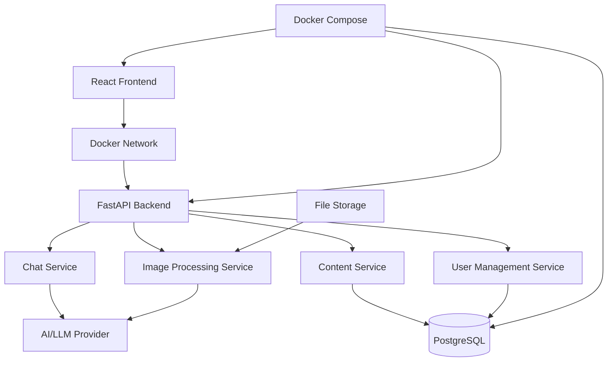

# Design Document

## Overview

The Language Learning Chat App is a web-based application that combines conversational AI with educational content management to create an engaging language learning experience. The system allows students to practice grammar and vocabulary through natural chat interactions while providing tools for content creation, organization, and collaboration.

## Architecture

### High-Level Architecture



### Technology Stack

- **Frontend**: React with TypeScript for type safety and component reusability
- **Backend**: Python with FastAPI for type-safe API services and automatic documentation
- **Database**: PostgreSQL for relational data (users, classes, learning sets)
- **AI Integration**: LangChain for LLM abstraction and provider flexibility
- **Image Processing**: Vision-capable LLM (GPT-4V, Claude Vision) via LangChain for intelligent text and content extraction
- **File Storage**: Local storage for temporary image processing (images deleted after processing)
- **Real-time**: WebSocket connections for live chat experience
- **Containerization**: Docker and Docker Compose for development and deployment
- **ORM**: SQLAlchemy with Alembic for database migrations

### LangChain Integration

**LLM Abstraction Benefits**:
- **Provider Flexibility**: Easy switching between OpenAI, Anthropic, or local models
- **Unified Interface**: Consistent API for both chat and vision capabilities
- **Built-in Retry Logic**: Automatic handling of rate limits and failures
- **Cost Optimization**: Token usage tracking and optimization
- **Prompt Templates**: Structured prompts for consistent AI behavior

**Implementation Approach**:
- Use LangChain's ChatOpenAI for conversational AI
- Implement vision processing with LangChain's multimodal capabilities
- Create custom chains for educational content extraction
- Implement streaming responses for real-time chat experience

### Docker Architecture

The application will be containerized with the following services:

- **Frontend Container**: React development server (dev) or served via Traefik (production)
- **Backend Container**: FastAPI application with Python runtime and LangChain
- **Database Container**: PostgreSQL with persistent volume
- **Traefik Container**: Reverse proxy with automatic service discovery and SSL termination
- **Redis Container**: For session management and WebSocket scaling (optional)

**Development Setup**:
- Docker Compose orchestrates all services
- Hot reloading for both frontend and backend development
- Shared volumes for code changes
- Environment-specific configuration files

**Production Setup**:
- Multi-stage Docker builds for optimized images
- Health checks and restart policies
- Secrets management for API keys and database credentials
- Traefik automatic service discovery and SSL certificate management
- Local volume for temporary image storage with automatic cleanup

## Components and Interfaces

### 1. Chat Interface Component

**Purpose**: Provides the main conversational learning experience

**Key Features**:
- Real-time messaging with AI tutor
- Grammar correction highlighting
- Vocabulary usage feedback
- Context-aware responses based on selected learning content

**Interface**:
```python
from pydantic import BaseModel
from datetime import datetime
from typing import Optional, List
from enum import Enum

class SenderType(str, Enum):
    USER = "user"
    AI = "ai"

class ChatMessage(BaseModel):
    id: str
    content: str
    sender: SenderType
    timestamp: datetime
    corrections: Optional[List[GrammarCorrection]] = None
    vocabulary_used: Optional[List[str]] = None

class ChatSession(BaseModel):
    id: str
    user_id: str
    learning_set_id: str
    messages: List[ChatMessage]
    start_time: datetime
    end_time: Optional[datetime] = None
```

### 2. Content Management System

**Purpose**: Handles creation, organization, and sharing of learning content

**Key Features**:
- Collections and Sets hierarchy
- Photo-to-content extraction
- Collaborative editing
- Permission management

**Interface**:
```python
class LearningSet(BaseModel):
    id: str
    name: str
    description: str
    vocabulary: List[VocabularyItem]
    grammar_topics: List[GrammarTopic]
    collection_id: str
    created_by: str
    shared_with: List[Permission]

class Collection(BaseModel):
    id: str
    name: str
    description: str
    sets: List[LearningSet]
    grade_level: str
    subject: str
```

### 3. Image Processing Service

**Purpose**: Uses vision-capable LLM to extract vocabulary and grammar concepts from photos of textbooks, handwritten notes, and worksheets

**Key Features**:
- Intelligent content extraction from both printed and handwritten text
- Context-aware vocabulary and grammar identification
- Automatic categorization by difficulty level and topic
- Structured output with confidence scoring
- Manual editing interface for refinements

**Interface**:
```python
class SourceType(str, Enum):
    PRINTED = "printed"
    HANDWRITTEN = "handwritten"
    MIXED = "mixed"

class ExtractedContent(BaseModel):
    vocabulary: List[VocabularyItem]
    grammar_topics: List[GrammarTopic]
    exercises: List[Exercise]

class ImageProcessingResult(BaseModel):
    extracted_content: ExtractedContent
    confidence: float
    source_type: SourceType
    suggested_grade_level: str
    needs_review: bool
```

### 4. Collaboration System

**Purpose**: Manages classes, groups, and content sharing

**Key Features**:
- Class creation and management
- Student enrollment
- Content sharing permissions
- Group collaboration tools

**Interface**:
```python
class Role(str, Enum):
    VIEWER = "viewer"
    EDITOR = "editor"
    OWNER = "owner"

class Class(BaseModel):
    id: str
    name: str
    teacher_id: str
    students: List[str]
    shared_content: List[str]
    invite_code: str

class Permission(BaseModel):
    user_id: str
    role: Role
    granted_by: str
    granted_at: datetime
```

## Data Models

### Core Entities

1. **User**
   - Basic profile information
   - Grade level and curriculum preferences
   - Learning progress tracking
   - Class memberships

2. **LearningSet**
   - Vocabulary items with definitions and examples
   - Grammar topics with rules and patterns
   - Metadata (difficulty, subject, etc.)
   - Usage statistics

3. **ChatSession**
   - Conversation history
   - Performance metrics
   - Learning objectives achieved
   - Time spent and engagement data

4. **Class/Group**
   - Member management
   - Shared content library
   - Collaboration permissions
   - Activity tracking

### Database Schema Considerations

- Use foreign keys to maintain referential integrity
- Index frequently queried fields (user_id, class_id, learning_set_id)
- Implement soft deletes for content that might be referenced
- Store chat messages with efficient pagination support

## Error Handling

### Image Processing Errors
- **Low Image Quality**: LLM can still process blurry/poor quality images but will indicate lower confidence
- **No Content Detected**: Offer manual entry option with guided templates
- **Processing Timeout**: Implement retry mechanism with exponential backoff
- **Handwriting Recognition Issues**: Provide feedback loop for improving recognition accuracy

### Chat Service Errors
- **AI Service Unavailable**: Provide offline mode with pre-generated responses
- **Rate Limiting**: Queue requests and inform users of wait times
- **Context Loss**: Maintain conversation state in local storage as backup

### Collaboration Errors
- **Permission Denied**: Clear error messages with suggested actions
- **Concurrent Editing**: Implement conflict resolution with merge capabilities
- **Network Issues**: Offline mode with sync when connection restored

## Testing Strategy

### Unit Testing
- **Component Testing**: React components with Jest and React Testing Library
- **Service Testing**: API endpoints with supertest
- **Utility Testing**: OCR processing, text parsing, and validation functions

### Integration Testing
- **API Integration**: End-to-end API workflows
- **Database Integration**: Data persistence and retrieval operations
- **External Service Integration**: AI provider and OCR service connections

### User Acceptance Testing
- **Learning Flow Testing**: Complete student learning sessions
- **Collaboration Testing**: Multi-user content creation and sharing
- **Mobile Responsiveness**: Touch interactions and mobile-specific features

### Performance Testing
- **Chat Response Times**: Measure AI response latency under load
- **Image Processing Speed**: LLM vision processing performance benchmarks
- **Database Query Performance**: Optimize queries for large datasets

### Accessibility Testing
- **Screen Reader Compatibility**: Ensure chat interface works with assistive technology
- **Keyboard Navigation**: Full functionality without mouse interaction
- **Color Contrast**: Meet WCAG guidelines for visual accessibility
- **Mobile Accessibility**: Touch target sizes and gesture support